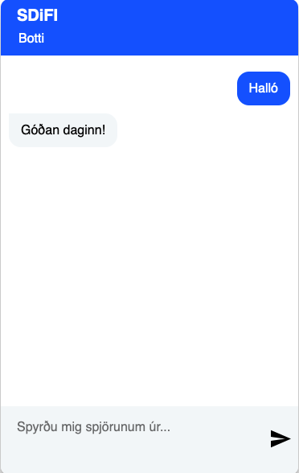

# Masdif - Manager for Spoken Dialog Framework

This project is a front-facing manager service for the spoken dialog framework for Icelandic. Masdif is a Rails
application and centralizes access to Icelandic conversational services like ASR, TTS and a dialog framework.
It aims to be independent from the underlying dialog system, but is currently based on the Rasa framework.

The manager provides a central place for saving chat, ASR and TTS logs into a database. Furthermore, it connects to
RabbitMQ and Redis for external communication or for future extension points.

Masdif is not meant to be your Rasa training environment. You need to obtain a previously trained Rasa model
and then use Masdif to deploy it in the context of conversational AI

We provide configurations for using Rasa in Icelandic via the repositories https://github.com/SDiFI/sdifi_rasa_akranes
and https://github.com/SDiFI/sdifi_rasa_ja. These Rasa projects can also be used standalone without Masdif.

# General architecture

## Frontend API

Masdif provides a REST API for the frontend. We provide a web widget that is served by Masdif itself but can also be
easily integrated into a web page. The widget source code can be found [here](https://github.com/SDiFI/webchat).

The following API endpoints are provided:

- `GET  /` - Serves the chat widget (configurable)
- `GET  /status` - Returns the status of the API
- `GET  /conversations` - Returns a list of all conversations
- `GET  /conversations/:id` - Returns history for a single conversation
- `POST /conversations/` - Creates a new conversation, returns JSON with the conversation id
- `PATCH/PUT /conversations/:id` - Appends message to conversation with given id, receives bot response as JSON
- `DELETE /conversations/:id` - Deletes conversation with given id, TODO: needs to be protected

The following API endpoints are planned for future versions:

- `GET  /admin` - web application for managing conversations
- `GET  /api` - shows the OpenAPI documentation
- `POST /conversations/:id/audio` - Appends audio recording to conversation with given id, i.e. synchronous ASR
- `GET  /version` - Returns the version of the Manager

The client sends messages via POST requests to Masdif. The POST request blocks on completion of all involved services.
All id's are UUID's and therefore unique. Only the client knows the conversation id, which is used to identify the
conversation in the database.

To be implemented:

- [ ] Add a timeout and lock the conversation after the last message has been sent for a certain time

##  Conversational services

### Dialog framework

The dialog framework is the core of the conversational AI. It is responsible for the actual dialog management and
dialog flow. It is also responsible for the actual dialog content, i.e. the answers to the users questions.
The dialog framework is implemented as a Rasa server. Rasa is a Python framework for conversational AI. It is based
on the concept of a dialog manager, which is responsible for the dialog flow and the dialog content and uses NLU
for understanding the users input and a dialogue policy for deciding what to do next. Actions are used to implement
the actual dialog content and can be extended with custom code.

Masdif communicates with the dialog framework via the [Rasa Rest API](https://rasa.com/docs/rasa/pages/http-api/).
The Rasa server is configured with a webhook that is called by Rasa after the dialog framework has processed the users
message. The webhook is called with the users message and the dialog framework response. Masdif then publishes the
response to RabbitMQ (TODO), saves all info to the database and returns the response to the client. Masdif extends the
functionality of Rasa by adding TTS and ASR support.

#### TTS

TTS can be enabled or disabled on a message by message basis. It's enabled by default if no `tts:false` is sent inside
the `metadata` object of the `PUT /conversations/:id` request, Masdif calls the TTS service and publishes the returned
voice audio as a link to the generated audio file.
The audio file is a Rails active storage attachment and can be downloaded via the returned link. Active storage
is by default configured to use the local file system, but can be easily configured to use a cloud storage service
like AWS S3 as well. If you want to change the storage service, you have to change `config/storage.yml` and the
`config/environments/production.rb` file.

Audio file attachments are deleted after a certain time, which is configurable via `config/tts.yml` and the configuration
value `tts_attachment_timeout` in seconds. The default is 5 minutes.

Currently, there are 2 publicly Icelandic TTS services available: the [Grammatek TTS API](https://api.grammatek.com/)
and the [Tíro TTS API](https://tts.tiro.is/). Both provide currently the same API and voices and are interchangeable.
A configuration for both is provided in [.env.example](.env.example). If you want to see a list of all available voices,
you can navigate to either [Grammatek TTS voices](https://api.grammatek.com/tts/v0/voices) or
[Tíro TTS voices](https://tts.tiro.is/v0/voices).

You can also run your own TTS service by running a compatible TTS service and adapt the configuration in
[config/tts.yml](config/tts.yml). Please refer to the [SIM TTS documentation](https://github.com/tiro-is/tiro-tts) for more information.

#### ASR

##### To be implemented

For ASR, POST requests can be sent to the audio endpoint of the Masdif API. Masdif then forwards the given audio to
the ASR service and uses the highest ranked result as new message to the dialog backend. The POST requests returns the
ASR result together with the answer from the dialog system.
Alternatively, you can use the gRPC endpoint either by sending audio synchronously to it or via a streaming request.
The latter is preferred for performance reasons and the web-chat widget does this by default.

ASR gRPC is implemented via 2 hops: a gRPC proxy and the real gRPC ASR service. The proxy mediates the users audio to
the real gRPC service and publishes it also via RabbitMQ to make it possible for more services to work on it, e.g.
for sentiment analysis or to control a virtual avatar.
If audio streaming is used, the ASR service streams back its results as soon as text is recognized. Previously returned
text can be corrected again depending on the users utterances, which gives the widget a sort of "live" feeling.
This is not possible if synchronous calls are used. Furthermore, streaming mode enables endpoint detection, which makes
it possible to detect when a user has stopped speaking, i.e. in the presence of silence.

Our web chat-bot widget provides a button to activate audio recording. As soon as the ASR service detects end of audio,
it sends a stop response to the widget which disables the audio recording button and sends all so far recognized text
to Masdif via a normal POST request.

# Installation

## tl;dr

For hasty people, here's a quick start:

```bash
git clone https://github.com/SDiFI/sdifi_rasa_akranes.git rasa && pushd rasa

# understand how to train a model
less README.md

# train it ... (your training actions follow here)

# make sure, that there is a model in the models directory
ls -l models/

popd
```

After training your model, execute these commands:

```bash
# use the example configuration for local development
cp .env.example .env
# Create a new pair of credentials
EDITOR=cat rails credentials:edit >/dev/null
RAILS_MASTER_KEY=$(cat config/master.key)
echo "RAILS_MASTER_KEY=$RAILS_MASTER_KEY" >> .env
# fetch the docker images
docker-compose pull
# start the docker containers in the background
docker-compose up -d
# only necessary once after first startup: create the database and run migrations
docker-compose exec masdif bundle exec rails db:prepare
```

Now you should be able to communicate with your bot via http://localhost:8080.

Alternatively, you can use the script [start-masdif.sh](start-masdif.sh) to build & start all docker containers.
This will clone the repository into sub-directory `rasa/`. The script will also create a new pair of credentials and
start the bot. You probably need to adapt it to your environment (e.g. pyenv, Python version).

## Details
Masdif as a Rails application operates in conjunction with Redis, Sidekiq and PostgreSQL. The latter is also a
development and test requirement, because we use certain features of PostgreSQL that are not available in SQLite,
while Redis and Sidekiq is optional as long as you don't care about persistent jobs for e.g. cleaning up old audio files.
By default, Redis and Sidekiq are disabled in the development and test environment, but are enabled in the Rails
production environment.

However, to be really useful, Masdif also needs Rasa and RabbitMQ and therefore all dependencies that are necessary to
run Rasa and the Rasa action server.
We therefore provide a Docker Compose file that starts all necessary services in a single command in conjunction with
a file `masdif_override_template.yml` which contains more service snippets that are necessary for running all features
of the Rasa project located in the subdirectory `./rasa`.

## Prerequisites

### docker-compose

You need to have Docker and docker-compose to be available on your system. If you are on a Linux system, you can
install Docker and docker-compose via your package manager. On Windows and Mac, you can install Docker Desktop, which
includes both Docker and docker-compose.

### Rasa configuration

Rasa's configuration is split among Masdif and the Rasa project located inside the subdirectory `./rasa`. Those files
provided by Masdif are necessary for communication and authentication, whereas the NLU configuration and the Rasa
model(s) are located inside the Rasa project.

The files [credentials.yml](config/rasa/credentials.yml) and [endpoints.yml](config/rasa/endpoints.yml) are provided
inside the directoy `./config/rasa`. These files are automatically mounted into the Rasa container when calling
`docker-compose up` and should be well understood before being changed.

### Rasa NLU & model files

As mentioned above, Masdif is not meant to be your Rasa training environment. You need to train your Rasa model
beforehand and then use Masdif to deploy it. A good starting point are the `sdifi_rasa_XXX` projects, which can be run
standalone but also integrate cleanly inside Masdif. You can find them on [GitHub](https://github.com/SDiFI).

A rasa project needs to be located in the `./rasa` subdirectory. You can either make a soft-link to the a checked out
version of your Rasa project or clone the Rasa project into the `./rasa` subdirectory.

Examples:

```bash
ln -s /path/to/your/rasa/project/ rasa
```

or e.g.

```bash
git clone https://github.com/SDiFI/sdifi_rasa_akranes rasa
```

## Building Docker images

You need to build all Docker images before you can start Masdif. The `docker-compose.yml` file is located in the root
directory of the project. The individual Docker files are located in the `docker/` subdirectory.

To build all Docker images, run the following command:

```bash
docker-compose build
```

Sometimes, there are problems with Docker build kit. If you get an error like
`failed to solve with frontend dockerfile.v0: failed to read dockerfile`, you need probably to use the following
commands before building via `docker-compose build`:

```bash
export DOCKER_BUILDKIT=0
export COMPOSE_DOCKER_CLI_BUILD=0
```

Alternatively, you can pull prebuilt images from the Grammatek Docker registry:

```bash
docker-compose pull
```

## Starting Masdif

Before starting Masdif, you need to create a `.env` file in the root directory of the project. You can use the
provided file [.env.example](.env.example) as a template.

After creating the `.env` file, start Masdif via:

```bash
docker-compose up -d
```

After initial startup, you need to run database migrations. This is done via:

```bash
docker-compose run --rm masdif bundle exec rails db:prepare
```

You should monitor the logs of Rasa and the action server to see if they are running correctly. You can
do this via:

```bash
docker-compose logs -f masdif_action_server
docker-compose logs -f masdif_rasa
```

Rasa needs quite some time to load the model and start up. You can check if Rasa is running correctly by
looking at the logs of the service `masdif_rasa`. Rasa is running correctly, if you see a line like

>INFO   -   Rasa server is up and running

But if you see the following line:

>**UserWarning**: No valid model found at models/ !

something is wrong with your model and you should check if model creation has been successful.

## Testing the installation

After you have made sure that Rasa is up, you can communicate with it via the Masdif REST API at `localhost:8080`.
First check the health of the Rasa server via:

```bash
curl http://localhost:8080/health
```

You should see a response like that:

```json
{
  "database": "OK",
  "dialog_system": "OK",
  "tts": "OK",
  "masdif": "OK",
  "sidekiq": "OK"
}
```

Chat to the bot:

```bash
conversationId=$(curl -s -X POST http://localhost:8080/conversations | jq -r '.conversation_id')
curl -s -X PUT -H "Content-Type: application/json" -d '{"text":"Hæ"}' http://localhost:8080/conversations/$conversationId
```

You should see a response similar to that:

```json
[{
  "recipient_id": "aedf1f23-25a5-4d65-9af6-5354781a3447",
  "text": "Góðan daginn!",
  "data": {
    "attachment": [{
      "type": "audio",
      "payload": {
        "src": "http://localhost:8080/rails/active_storage/blobs/redirect/eyJfcmFpbHMiOnsibWVzc2FnZSI6IkJBZ3ciLCJleHAiOm51bGwsInB1ciI6ImJsb2JfaWQifX0=--9963f10922377d2ddfeedb79d064f27cba02e362/DTlrRdkW2Tnpy7FwxoN8kGo8efe6TInHO3VVlfvGt68=.mp3"
      }
    }]
  }
}]
```

### Web chat widget

<div style="text-align:center">

</div>

The [SDiFI web-chat widget](https://github.com/SDiFI/webchat) is enabled by default and is served directly at
http://locahost:8080. It can be configured to be served at a different URL if you edit the
[Masdif configuration file](config/masdif.yml) and change the setting `chat_widget.path` to another value.

You can disable the web-chat widget by setting `chat_widget.enabled` to `false`.

# Development workflow

Besides running Masdif via `docker-compose up`, you can also run Masdif in development mode. This is useful if you
want to make changes to the code and see the effects immediately.
Masdif is a Ruby on Rails application and uses PostgreSQL as database as well as Sidekiq for background jobs, which
again uses Redis as a message broker.

## Prerequisites
We propose that you use docker-compose to run Rasa, the database, Redis and use your local Ruby installation to run
the Rails application Masdif.

The following steps describe how to set up a development environment.

Expose all required services to TCP ports available from Ruby on Rails. This can easily be done without the need to edit
`docker-compose.yml` by adding a `docker-compose.override.yml` file to the root directory of the project:

```yaml
services:
    rasa:
        ports:
        - "5005:5005"
    redis:
        ports:
        - "6379:6379"
    db:
        ports:
        - "5432:5432"
```

Furthermore, you need to export environment variables in your shell like those inside [.env.example](.env.example).

# Production considerations

## Models and dependencies

You need to have trained a Rasa model before you can use Masdif. If you use our standard NLP pipeline, you need
additionally the appropriate language model from Huggingface. Rasa automatically downloads the language model when it
loads the model and saves it into a cache directory. As this might need a lot of time, we use the directory `cache/` to
store the language model files persistently. Whenever Rasa is started, the language model is tried to be loaded again
from there.

When building the containers via `docker-compose build`, the models and language models are not copied into them,
as one should be able to exchange them without rebuilding the containers. Instead, the models are mounted  via
directory mounts.

When deploying Masdif, you need to transfer the trained Rasa model to the server. For startup speed
considerations, you should also transfer the language model. Inside the container, the environment variable
`TRANSFORMERS_CACHE` determines the cache directory for the language model. You can set this variable in the file
`.env`. Please make sure, to also change the mounted directory in `docker-compose.yml` in case you want to change the
default path.

If you retrain a Rasa model, you need to copy the new model to the server and restart the container `masdif_rasa`.
Usually, downloading a new language model is not necessary as long as the NLP pipeline hasn't changed.
In the time of restarting the container, Rasa will not be available.

## Secrets

You should generate a fresh keypair of `config/credentials.yml.enc` and `config/master.key` and store them in
a secure location. You can generate a new keypair via:

```bash
rm -f config/credentials.yml.enc config/master.key
bundle exec rails credentials:edit
```

The file `master.key` needs to exist before building the masdif container, but will be deleted from it after the
container has been built. Please never commit `master.key` to the repository.
You should set the environment variable `RAILS_MASTER_KEY` to the contents of `config/master.key` in an
`.env` file when starting the container. This can be done by adding the following line:

```bash
RAILS_MASTER_KEY=$(cat config/master.key)
echo "RAILS_MASTER_KEY=$RAILS_MASTER_KEY" >> .env
```

## Reverse proxy

When running in production, you should use a reverse proxy like Nginx to serve the static assets and to handle SSL.
Please refer to the documentation of your reverse proxy.
When using `docker-compose`, you should mount a volume containing the static assets to the containers for Nginx and Masdif.
The assets are located in `public/assets` and are generated via `bundle exec rails assets:precompile` inside the Masdif
container at build time.

## Concurrency / throughput

You need to test your Rasa / Rasa action server including ASR/TTS to get an idea for the min/max throughput time of your
overall system for one request and how many requests can be sent concurrently.
Many of the dialog management steps need to run sequentially (ASR => Rasa => Rasa Action => TTS). Activating /
deactivating ASR / TTS and the choice of the concrete service will influence the overall throughput for a request /
response cycle. If one of the services in the chain cannot run more than N concurrent requests, Masdif as a whole
cannot run more than N concurrent requests and it doesn't make sense to scale out e.g. Rasa, if the TTS service cannot
handle more concurrent requests. Balance the number of workers for Rails/Sidekiq accordingly.

Usually, the bottlenecks are ASR and TTS which need between 500ms - 1500ms per request depending on server/input length.
Masdif itself should be able to handle hundreds of requests per second, but this depends on the number of workers and
the overall system performance.
If you need high availability (HA), you should consider using a load balancer to distribute the requests to multiple
Rasa instances. You should also consider HA for all dependent services. However, this scenario is outside the scope of
this documentation.

# Copyright & License

All code is Copyright © 2023 Grammatek ehf, licensed under the Apache License, Version 2.0.

See [LICENSE](LICENSE) for the full license text.